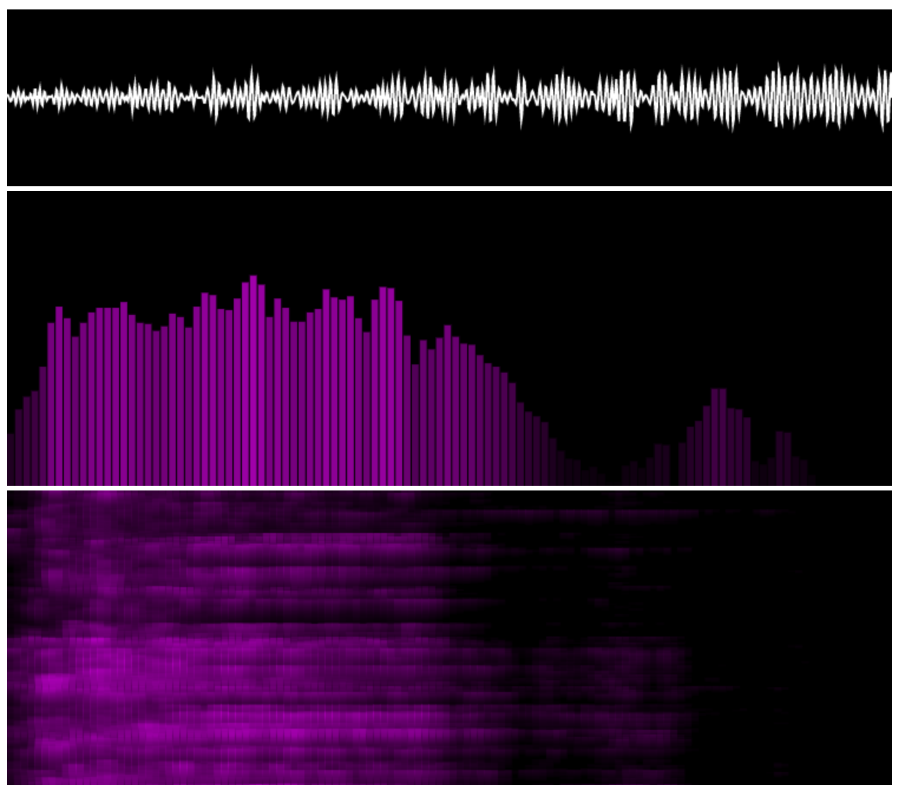

# vue-audio-visuals

_NOTE:_ the components in this repository are a work-in-progress, and an
exercise in working with media streams and the HTML canvas element.



## Project setup

```
yarn install
```

### Compiles and hot-reloads for development

```
yarn serve
```

### Compiles and minifies for production

```
yarn build
```

### Lints and fixes files

```
yarn lint
```

### Customize configuration

See [Configuration Reference](https://cli.vuejs.org/config/).
